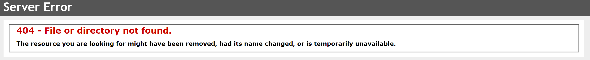

# 💻 08. API's uitlezen > oefening 05

## 🛠️ opdrachten

Tijdens dit labo leer je
 - gebruik maken van een API-sleutel voor toegang.

### Postman opstarten

 - Start Postman.

### authentificatie met api key

 - [API: News API](https://newsapi.org)
 - endpoint: /top-headlines

https://newsapi.org/top-headlines?aa250809e70e4dbf800324755a52ba5e

1. Maak een nieuw verzoek naar de API.key
2. Gebruik de endpoint /top-headlines.
3. Voeg een X-Api-Key header toe met je API-sleutel.
4. Voer het verzoek uit en bekijk de respons.
